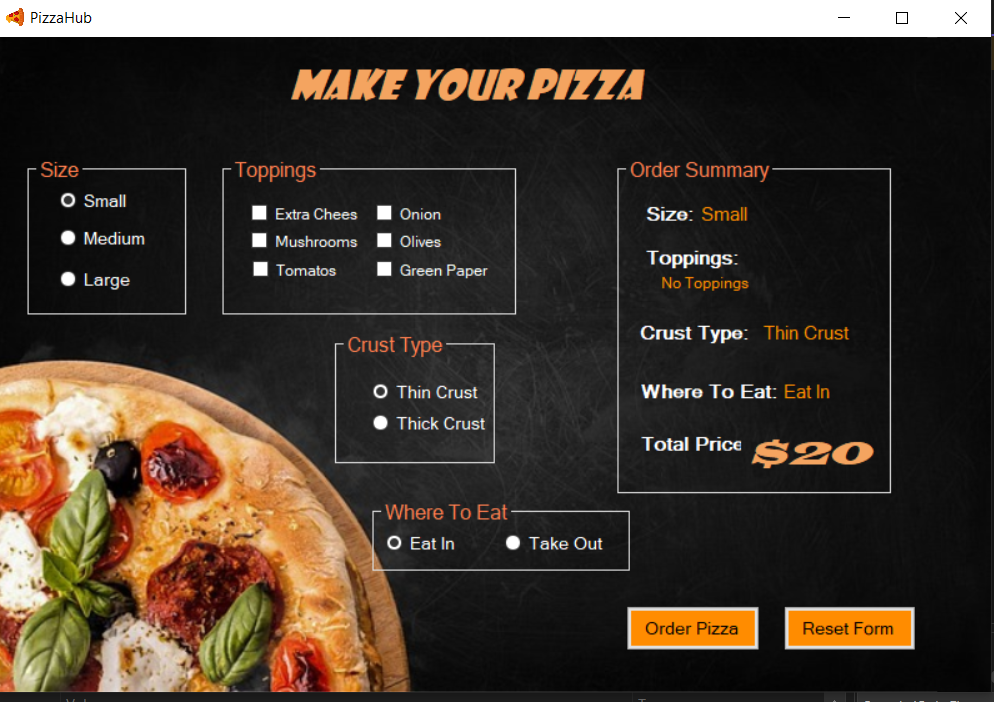

### PizzaHub - A Delicious Pizza Ordering System
<h3></h3>
PizzaHub is a delightful and user-friendly pizza ordering system built using the .NET platform and Windows Forms with C#. Whether you're a pizza lover, a developer, or both, this project offers a scrumptious experience that combines the joy of pizza with the power of technology.

<strong>Features:</strong>

1- Easy Ordering Process: With PizzaHub, ordering your favorite pizza has never been easier. Simply select your desired toppings, crust type, and size, and let the app take care of the rest.

2- Interactive User Interface: We've crafted a visually appealing and intuitive user interface using Windows Forms, ensuring a seamless and enjoyable ordering experience.

3- Customization Options: PizzaHub allows you to customize your pizza to your heart's content. Choose from a variety of toppings, sauces, and cheese options to create your perfect slice.

4- Payment Integration: PizzaHub supports secure online payment methods, making it convenient for customers to complete their transactions without any hassle.

Whether you're a pizza parlor looking to streamline your operations or a developer looking for a practical project to learn Windows Forms and C#, PizzaHub is the perfect solution. Clone this repository and start building a tasty pizza ordering system today!

Note: This project is for educational purposes and can be customized to fit your specific requirements and preferences.
